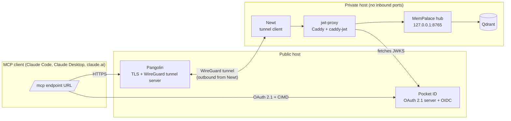

# Running a MemPalace hub behind Newt/Pangolin with Pocket ID OAuth

How to host a MemPalace shared-brain hub on a private machine with no open inbound ports, reach
it through a [Pangolin](https://github.com/fosrl/pangolin) tunnel, and put a
[Pocket ID](https://pocket-id.org/) OAuth 2.1 login in front of it. The hub itself only
understands one static bearer token. A small Caddy container verifies each client's JWT and swaps
it for that token, so the hub is unchanged.

This is a full walkthrough. Every stage lists the exact files to create, the commands to run and
a check to confirm it worked before you move on. Container names, ports and domains below are
examples. Swap in your own, using the table in [Names you will replace](#names-you-will-replace).

## How it works

Pocket ID (v2.13.0 or newer) is the OAuth 2.1 authorization server. Clients identify themselves
with a Client ID Metadata Document (CIMD): the `client_id` is a URL to a JSON document the client
publishes, so there is no client registration, no client secret and nothing to paste into the
client. Claude Code, Claude Desktop, the Claude mobile apps and claude.ai all support this.

Claude Code runs on your machine, so its requests to Pocket ID come from your IP. Claude Desktop,
the mobile apps and claude.ai run the connector from Anthropic's servers, so their discovery and
token requests come from Anthropic's addresses. Stage 1 covers what that means for access rules.

## Components

| Component | Role | Homepage |
|---|---|---|
| [MemPalace](https://github.com/MemPalace/mempalace) | The hub (`mempalace serve`) | https://mempalaceofficial.com |
| [Qdrant](https://github.com/qdrant/qdrant) | Vector store behind MemPalace | https://qdrant.tech |
| [Pocket ID](https://github.com/pocket-id/pocket-id) | OIDC provider with passkey login, acting as the OAuth 2.1 authorization server | https://pocket-id.org |
| [Caddy](https://github.com/caddyserver/caddy) + [caddy-jwt](https://github.com/ggicci/caddy-jwt) | Verifies the Pocket ID JWT and injects the hub's static token | https://caddyserver.com |
| [Pangolin](https://github.com/fosrl/pangolin) | Tunnelled reverse proxy, TLS and control plane on the public host | https://docs.pangolin.net |
| [Newt](https://github.com/fosrl/newt) | Tunnel client on the private host. Dials out to Pangolin, so no inbound ports | https://github.com/fosrl/newt |

The Caddy container is called `jwt-proxy` throughout. That is the job it does. Caddy is the
program inside it, `caddy-jwt` is the plugin that does the token checking, and
`mempalace-jwt-proxy:local` is the name of the image you build in stage 5. They are all the same
one container.

## Architecture

Two hosts. A small public VPS runs the Pangolin stack and Pocket ID. A private host on your LAN
runs everything else and connects to the VPS with an outbound WireGuard tunnel.



Request flow:

1. The client sends a request to `/mcp` on your public domain with no token.
2. jwt-proxy answers `401` with a `WWW-Authenticate` header pointing at the protected-resource
   metadata document. The client reads it and learns the authorization server and the scope.
3. The client runs an authorization-code flow with PKCE against Pocket ID, using its CIMD URL as
   `client_id`, the MCP URL as the RFC 8707 `resource`, and the scopes `mempalace:use` and
   `offline_access`. The user logs in with a passkey. Pocket ID issues a one-hour access token
   with the MCP URL in `aud`, plus a 30-day refresh token.
4. The client retries with `Authorization: Bearer <JWT>`. Pangolin terminates TLS and sends the
   request down the tunnel to Newt, which delivers it to jwt-proxy.
5. jwt-proxy checks the signature against Pocket ID's JWKS, the issuer, the audience, the
   algorithm and the expiry, then replaces the `Authorization` header with the hub's static token
   and forwards the request.
6. The hub answers.

## Before you start

You need:

- **A public host.** A small VPS with a public IP address, running Docker. 1 vCPU and 1 GB of
  RAM is enough. This runs Pangolin and Pocket ID.
- **A private host.** Any always-on machine on your LAN with Docker installed: a NAS, an Unraid
  box, a mini PC, a spare laptop. This runs MemPalace, Qdrant and jwt-proxy. It needs no open
  inbound ports and no public IP.
- **A domain name** you control, with access to its DNS records. You will point three names at
  the public host's IP: one for the Pangolin dashboard, one for Pocket ID, one for the hub.
- **A terminal** on each host, and enough comfort to copy commands into it and read the output.
- **A passkey-capable device** for the Pocket ID login (any modern phone or laptop).

Check Docker is ready on the private host before you start. Both commands should print a version:

```bash
docker --version
docker compose version
```

If `docker compose version` fails but `docker-compose --version` works, you have the old
standalone tool. Use `docker-compose` in place of `docker compose` in every command below.

Set aside an hour. Stages 1 to 3 happen on the public host and in a browser. Stages 4 to 9 happen
on the private host. Stages 10 to 12 finish on the public host and in your clients.

## Names you will replace

Every example below uses these placeholders. Decide your real values now and keep them somewhere
you can copy from, because the same values appear in several files and they must match exactly.

| Placeholder | What it is | Example real value |
|---|---|---|
| `example.com` | Your domain | `mydomain.net` |
| `pangolin.example.com` | Where the Pangolin dashboard lives | `pangolin.mydomain.net` |
| `id.example.com` | Where Pocket ID lives. This is the **issuer** | `id.mydomain.net` |
| `mcp.example.com` | Public hostname for the hub | `brain.mydomain.net` |
| `https://mcp.example.com/mcp` | The full hub URL. This is the **resource** | `https://brain.mydomain.net/mcp` |
| `mempalace:use` | The scope name. Keep as is unless you have a reason | `mempalace:use` |

Two rules that cause most of the failures in this setup:

- The resource URL must be **byte for byte identical** in Pocket ID (stage 3), in the compose
  file (stage 6) and in the client (stage 12). No trailing slash, no `http` where you meant
  `https`, `/mcp` on the end everywhere.
- The issuer is the Pocket ID base URL with **no trailing slash** and no path.

## Setup

### 1. Public host: Pangolin and Pocket ID

Follow Pangolin's [quick start](https://docs.pangolin.net) to stand up Pangolin on the VPS. Its
installer asks for your domain and sets up TLS certificates for you. Then add Pocket ID v2.13.0
or newer alongside it, following the [Pocket ID docs](https://pocket-id.org/docs/), and create
your admin user and passkey.

Point your DNS records at the VPS before running either installer, or certificate issuance
fails.

If you apply geo, IP or WAF rules to the Pocket ID hostname, leave these paths open from
anywhere. Anthropic's servers fetch them for Claude Desktop, mobile and claude.ai, and they
contain nothing secret:

```
/.well-known/oauth-authorization-server
/.well-known/openid-configuration
/.well-known/jwks.json
/api/oidc/token
```

The login page (`/authorize` and the interaction UI) is opened by the user's own browser and can
stay restricted.

**Check it worked.** From any machine, this should print a JSON document:

```bash
curl -s https://id.example.com/.well-known/openid-configuration | head -c 200
```

If it returns nothing, an HTML error page or a certificate warning, fix that before going on.

### 2. Pocket ID: allow CIMD clients

Log in to Pocket ID as an admin. Under Application Configuration, set the CIMD allowlist. The
setting is `cimdUrlAllowlist` (environment variable `CIMD_URL_ALLOWLIST`), a JSON array as a
string:

```
CIMD_URL_ALLOWLIST=["https://claude.ai/oauth/mcp-oauth-client-metadata", "https://claude.ai/oauth/claude-code-client-metadata"]
```

The first URL is Claude Desktop, mobile and claude.ai. The second is Claude Code. Add both, even
if you only plan to use one today.

**Check it worked.**

```bash
curl -s https://id.example.com/.well-known/openid-configuration | jq .client_id_metadata_document_supported
# true
```

The flag is true whenever the allowlist is non-empty. There is no separate switch. If it prints
`false` or `null`, the allowlist did not save.

### 3. Pocket ID: register the API and its permission

Still in Pocket ID, under Administration, APIs, create an API. The resource is the exact URL
clients will call, including `/mcp`:

```
Name:     MemPalace MCP
Resource: https://mcp.example.com/mcp
```

Add one permission. Its key is the scope clients request and must equal `MCP_SCOPE` in stage 6:

```
Key:         mempalace:use
Name:        Use the MemPalace hub
Description: Read and write memories on the shared-brain hub
```

Open the API's Access card, enable access for metadata document clients, and tick the permission.
**Both are off on a new API**, and forgetting either is the most common cause of a login that
completes but leaves the client unauthorised.

No OIDC client, client secret or client-access rule is needed. Pocket ID adds an entry under OIDC
clients on each client's first login, named `Claude` (Desktop, mobile, web) or `Claude Code`,
with the metadata URL as the id. Refresh tokens and consents belong to those entries, so deleting
one signs out every device that uses it.

### 4. Private host: create the project folder

Everything on the private host lives in one folder. Create it and the two subfolders now. This
example uses `~/mempalace-hub`, but any path works as long as you stay in it for the rest of the
walkthrough.

```bash
mkdir -p ~/mempalace-hub/jwt-proxy
mkdir -p ~/mempalace-hub/data/qdrant ~/mempalace-hub/data/mempalace ~/mempalace-hub/data/mempalace-home
sudo chown -R 1000:1000 ~/mempalace-hub/data/mempalace ~/mempalace-hub/data/mempalace-home
cd ~/mempalace-hub
```

The MemPalace container runs as user id 1000, so it needs to own its two folders. Without the
`chown` it cannot write its palace.

By the end of stage 6 the folder looks like this:

```
mempalace-hub/
├── .env                  # the one secret
├── docker-compose.yml    # the three services
├── data/                 # your memories live here, back this up
│   ├── mempalace/        # the palace: drawers index, knowledge graph, event log
│   ├── mempalace-home/   # the hub's home folder: caches and anything else it writes
│   └── qdrant/
└── jwt-proxy/
    ├── Dockerfile        # builds Caddy with the JWT plugin
    └── Caddyfile         # the token-checking rules
```

The file names matter. `docker compose` looks for `docker-compose.yml` and `.env` by name, and
the compose file refers to the other two by path.

### 5. Private host: write the jwt-proxy files

Two files go in the `jwt-proxy` folder you just made.

**`jwt-proxy/Dockerfile`.** Stock Caddy has no JWT support, so this builds a Caddy binary with
the `caddy-jwt` plugin compiled in, then copies it into a clean image:

```dockerfile
FROM caddy:2-builder-alpine AS builder
RUN xcaddy build --with github.com/ggicci/caddy-jwt

FROM caddy:2-alpine
COPY --from=builder /usr/bin/caddy /usr/bin/caddy
```

Create it with an editor, or paste this whole block into the terminal:

```bash
cat > jwt-proxy/Dockerfile <<'EOF'
FROM caddy:2-builder-alpine AS builder
RUN xcaddy build --with github.com/ggicci/caddy-jwt

FROM caddy:2-alpine
COPY --from=builder /usr/bin/caddy /usr/bin/caddy
EOF
```

**`jwt-proxy/Caddyfile`.** This is the configuration that container runs. It serves the
protected-resource metadata, a health route and `/mcp`, and answers 404 to everything else,
matching the reference server in Pocket ID's
[mcp-oauth-demo](https://github.com/pocket-id/mcp-oauth-demo). The `{$NAME}` placeholders are
filled in at runtime from the environment set in the compose file, so this file needs no editing:

```
{
	order jwtauth before basicauth
	auto_https off
	admin off
}

:80 {
	log

	# RFC 9728 protected-resource metadata, at the bare path and the
	# path-suffixed form. Clients differ on which they request.
	@discovery path /.well-known/oauth-protected-resource /.well-known/oauth-protected-resource/*
	handle @discovery {
		header Content-Type application/json
		respond `{"resource":"{$MCP_RESOURCE_URL}","authorization_servers":["{$PID_ISSUER}"],"scopes_supported":["{$MCP_SCOPE}"],"bearer_methods_supported":["header"],"resource_name":"MemPalace shared-brain hub"}` 200
	}

	# Unauthenticated, for the reverse proxy's health check. Keep it outside
	# the jwtauth block or the probe gets a 401 and the target is taken out
	# of service.
	handle /health {
		respond "OK" 200
	}

	# Everything except the MCP endpoint is 404. The authorization-server
	# discovery paths (/register, /authorize, /token,
	# /.well-known/oauth-authorization-server) must not return 401, or a
	# client concludes an authorization server lives on this origin.
	@not_mcp not path /mcp /mcp/*
	handle @not_mcp {
		respond 404
	}

	handle {
		jwtauth {
			jwk_url {$PID_ISSUER}/.well-known/jwks.json
			sign_alg RS256
			issuer_whitelist {$PID_ISSUER}
			audience_whitelist {$MCP_RESOURCE_URL}
		}

		# MemPalace is a stateless MCP server and issues no session id. The
		# claude.ai connector's tools-refresh action needs one, so stamp an id
		# on responses to requests that do not already carry one (the
		# initialize response). Nothing downstream checks the value.
		@noSession not header Mcp-Session-Id *
		header @noSession {
			Mcp-Session-Id {http.request.uuid}
			defer
		}

		reverse_proxy mempalace:8765 {
			header_up Authorization "Bearer {$MEMPALACE_MCP_HTTP_TOKEN}"
		}
	}

	# A bare 401 gives the client nothing to discover from.
	handle_errors {
		@unauthorized expression {err.status_code} == 401
		header @unauthorized WWW-Authenticate `Bearer resource_metadata="{$MCP_RESOURCE_BASE}/.well-known/oauth-protected-resource/mcp"`
		respond "{err.status_code} {err.status_text}" {err.status_code}
	}
}
```

The Caddyfile is indented with tabs. If you paste it into an editor that converts tabs to spaces
it still works, but keep the nesting intact.

**Check it worked.** Both files exist and are not empty:

```bash
ls -l jwt-proxy/
# Caddyfile  Dockerfile
```

### 6. Private host: write the compose file and the secret

**The secret first.** One long random string is the only secret in this setup. MemPalace accepts
it as its own auth token, and jwt-proxy sends it upstream on every verified request. Generate it
and write it straight into `.env` so it never appears on your screen or in your shell history:

```bash
printf 'MEMPALACE_MCP_HTTP_TOKEN=%s\n' "$(openssl rand -hex 32)" > .env
chmod 600 .env
```

If this folder is ever in a git repository, add `.env` to `.gitignore`.

**`docker-compose.yml`.** Three services: the vector store, the hub, and the proxy in front of
it. Replace the four values under `jwt-proxy` `environment:` with your own from the
[names table](#names-you-will-replace):

```yaml
name: mempalace-hub

services:
  qdrant:
    image: qdrant/qdrant:latest
    container_name: mempalace-qdrant
    restart: unless-stopped
    volumes:
      - ./data/qdrant:/qdrant/storage

  mempalace:
    image: ghcr.io/mempalace/mempalace:latest
    container_name: mempalace
    restart: unless-stopped
    depends_on:
      - qdrant
    command: ["serve", "--palace", "/data/.mempalace/palace", "--host", "0.0.0.0", "--port", "8765", "--backend", "qdrant"]
    volumes:
      - ./data/mempalace-home:/data
      - ./data/mempalace:/data/.mempalace
    environment:
      MEMPALACE_CONFIG_DIR: /data/.mempalace
      MEMPALACE_QDRANT_URL: http://qdrant:6333
    env_file:
      - .env   # MEMPALACE_MCP_HTTP_TOKEN
    ports:
      - "127.0.0.1:8765:8765"

  jwt-proxy:
    build: ./jwt-proxy
    image: mempalace-jwt-proxy:local
    container_name: mempalace-jwt-proxy
    restart: unless-stopped
    depends_on:
      - mempalace
    env_file:
      - .env   # MEMPALACE_MCP_HTTP_TOKEN, read by the Caddyfile
    environment:
      PID_ISSUER: https://id.example.com
      MCP_RESOURCE_URL: https://mcp.example.com/mcp
      MCP_RESOURCE_BASE: https://mcp.example.com
      MCP_SCOPE: mempalace:use
    volumes:
      - ./jwt-proxy/Caddyfile:/etc/caddy/Caddyfile:ro
    ports:
      - "127.0.0.1:8092:80"
```

`build: ./jwt-proxy` is what ties this back to stage 5: it builds the Dockerfile in that folder
and tags the result `mempalace-jwt-proxy:local`. Nothing pulls that image from a registry, and
nothing else needs installing.

Both published ports are bound to `127.0.0.1`, so neither is reachable from your LAN or the
internet. Only Newt, running on the same host, talks to them.

The three MemPalace settings keep the palace in one fixed place. `--palace` names the palace
folder, `MEMPALACE_CONFIG_DIR` puts the hub's configuration and write log beside it, and the
`/data` mount covers the rest of the container's home folder. The image declares `/data` as a
volume, so without that mount anything the hub writes there lands in an anonymous Docker volume
instead of your `data/` folder. Keep all three when you edit the file. The Qdrant collections
are named after the palace path, so the hub finds its drawers only while `--palace` stays the
same.

**Check it worked.** Compose can read the file and has filled in the variables:

```bash
docker compose config >/dev/null && echo "compose file OK"
```

### 7. Private host: build and validate

Build the proxy image. The first build takes a couple of minutes because it compiles Caddy:

```bash
docker compose build jwt-proxy
```

**Check the plugin is in the binary.** This is the whole point of the build, so confirm it before
starting anything:

```bash
docker run --rm mempalace-jwt-proxy:local caddy list-modules | grep jwt
# http.authentication.providers.jwt
```

No output means the plugin did not compile in. Rebuild it with
`docker compose build --no-cache jwt-proxy` and read the build output for the failure.

**Check the Caddyfile parses.** Substitute your own four values here as well:

```bash
docker run --rm -e MCP_RESOURCE_URL=https://mcp.example.com/mcp \
  -e MCP_RESOURCE_BASE=https://mcp.example.com -e MCP_SCOPE=mempalace:use \
  -e PID_ISSUER=https://id.example.com -e MEMPALACE_MCP_HTTP_TOKEN=dummy \
  -v "$PWD/jwt-proxy/Caddyfile:/etc/caddy/Caddyfile:ro" \
  mempalace-jwt-proxy:local caddy validate --config /etc/caddy/Caddyfile --adapter caddyfile
```

A successful validate also logs that it loaded the JWK cache from your JWKS URL, which confirms
the issuer is reachable and correctly spelled.

### 8. Private host: start the stack

```bash
docker compose up -d
```

**Check it worked.** All three containers say `running` or `Up`:

```bash
docker compose ps
```

The proxy answers its health route:

```bash
curl -s -o /dev/null -w "%{http_code}\n" http://127.0.0.1:8092/health
# 200
```

An unauthenticated request to `/mcp` is refused, and the refusal tells a client where to go:

```bash
curl -si http://127.0.0.1:8092/mcp | head -3
# HTTP/1.1 401 Unauthorized
# Www-Authenticate: Bearer resource_metadata="https://mcp.example.com/.well-known/oauth-protected-resource/mcp"
```

That 401 is a success, not a fault. It is how every client discovers the login.

The hub is using the palace folder you mounted:

```bash
docker compose logs mempalace | grep -m1 "palace   :"
#   palace   : /data/.mempalace/palace
```

If a container is restarting, read its output with `docker compose logs jwt-proxy` or
`docker compose logs mempalace`.

### 9. Private host: Newt

Newt is the tunnel client. It makes an outbound WireGuard connection to Pangolin, so no port
forwarding and no inbound firewall rule is needed anywhere.

In the Pangolin dashboard on the public host, create a Site. Pangolin gives you a `NEWT_ID` and a
`NEWT_SECRET`. Copy both.

Add Newt to the same `docker-compose.yml`, as a fourth entry under `services:` at the same
indentation as `jwt-proxy`:

```yaml
  newt:
    image: fosrl/newt
    container_name: newt
    restart: unless-stopped
    environment:
      PANGOLIN_ENDPOINT: https://pangolin.example.com
      NEWT_ID: <from the Site>
      NEWT_SECRET: <from the Site>
```

Then `docker compose up -d` again to start it.

Unraid users can instead install Newt from Community Applications with the
[official template](https://github.com/fosrl/newt) and put the same three values in its template
fields.

**Check it worked.** The Site shows as connected or online in the Pangolin dashboard within about
thirty seconds. `docker compose logs newt` shows a successful registration and no repeating
errors.

### 10. Public host: the Pangolin Resource

Under the Site you just created, add a Resource for your public domain (`mcp.example.com`)
pointing at jwt-proxy. The target is either the published host port (`127.0.0.1:8092`) or, if
your containers share a docker network with Pangolin, the container alias and internal port
(`mempalace-jwt-proxy:80`).

If you enable a health check on the target, point it at `/health`. The health check has its own
host and port fields, separate from the traffic target. **Update both together**, or the check
probes an address that no longer serves traffic and Pangolin quietly takes the target out of
service.

**Check it worked.** From any machine on the internet:

```bash
curl -s -o /dev/null -w "%{http_code}\n" https://mcp.example.com/health
# 200
```

If that returns a Pangolin error page, the tunnel or the target address is wrong. If it hangs,
check DNS for `mcp.example.com` points at the public host.

### 11. Test the server side

This request is the one Claude Desktop makes. Run it before touching any client, because it tests
Pocket ID's side of the setup on its own. A `302` to the interaction page means Pocket ID
accepted the client, the resource and the scope. `state` must be at least 8 characters.

```bash
curl -s -o /dev/null -w "%{http_code} %{redirect_url}\n" \
  "https://id.example.com/authorize?response_type=code\
&client_id=https%3A%2F%2Fclaude.ai%2Foauth%2Fmcp-oauth-client-metadata\
&redirect_uri=https%3A%2F%2Fclaude.ai%2Fapi%2Fmcp%2Fauth_callback\
&resource=https%3A%2F%2Fmcp.example.com%2Fmcp\
&scope=mempalace%3Ause%20offline_access\
&code_challenge=E9Melhoa2OwvFrEMTJguCHaoeK1t8URWbuGJSstw-cM&code_challenge_method=S256\
&state=abcdefgh12345678"
# 302 https://id.example.com/interaction?interaction=...
```

Anything other than a 302 to `/interaction` means a stage 2 or stage 3 setting is wrong. A `400`
usually names the problem in the response body, so rerun without `-o /dev/null` to read it.

### 12. Connect the clients

**Claude Code:**

```bash
claude mcp add --transport http --scope user <name> https://mcp.example.com/mcp
```

No `--header` flag. A static `Authorization` header bypasses the OAuth flow. Run `/mcp` inside
Claude Code, select the server and choose Authenticate. A browser opens for the Pocket ID login
and the client stores a refreshable token.

**Claude Desktop, mobile and claude.ai:** add a custom connector with the URL
`https://mcp.example.com/mcp`. Leave the OAuth client id and secret fields empty. The connector
discovers Pocket ID and opens the login page. One login covers all three, since they share the
connector.

**Check it worked.** After the first login the client appears under OIDC clients in Pocket ID,
the consent screen lists the `mempalace:use` permission, and the client lists the MemPalace tools.
Ask it to save and recall something to confirm the round trip.

## Everyday operations

**Change the Caddyfile.** With `admin off`, `caddy reload` is unavailable. Restart the container
to apply changes:

```bash
docker compose restart jwt-proxy
```

The Pangolin health check takes the target out of service for about a minute while it restarts.

**Update the images.** Back up first (below), and note the palace's drawer count and replica id
so you can compare them afterwards:

```bash
docker compose exec mempalace mempalace --palace /data/.mempalace/palace status | grep drawers | head -1
cat data/mempalace/palace/replica.json
```

Then update:

```bash
docker compose pull
docker compose build --pull jwt-proxy
docker compose up -d
```

**Check it worked.** The startup log still shows `palace   : /data/.mempalace/palace`, the drawer
count is the same or higher, and `replica.json` shows the same `replica_id`. If the count has
dropped or the replica id has changed, the hub has started a new, empty palace. Stop it with
`docker compose stop mempalace`, put back any of the three settings from stage 6 that are missing
from the compose file, and run `docker compose up -d`. Your old palace is still in `data/`.

Avoid `docker compose down -v`. It deletes the stack's volumes along with the containers.

**Back up.** The `data/` folder holds every memory: the palace in `data/mempalace`, the vectors in
`data/qdrant`. Stop the stack first so the databases are closed, copy the whole folder, then
start it again:

```bash
docker compose stop
cp -a data "data-backup-$(date +%Y%m%d)"
docker compose start
```

Copy each `.sqlite3` file together with its `-wal` and `-shm` files. Recent changes live in the
`-wal` file until SQLite folds them in, so a copy without it is missing data. `cp -a` of the
whole folder keeps them together. Nothing else in the project folder is irreplaceable, though
losing `.env` means editing the token back into place on both sides.

## Reading the logs

```bash
docker compose logs -f jwt-proxy
```

The Caddy `log` directive writes one JSON line per request. Read it by user agent. The claude.ai
connector uses `python-httpx` for its OAuth worker, which sends one unauthenticated probe, gets a
401 and fetches the discovery document, and `Claude-User` for MCP calls, which return 200 and
202. A healthy connection starts with that 401. Claude Code identifies as
`claude-code/<version>`.

Pocket ID's audit log records `NEW_CLIENT_AUTHORIZATION` on a user's first consent to a client
and `CLIENT_AUTHORIZATION` on each later login.

## Troubleshooting

| Symptom | Likely cause |
|---|---|
| `docker run ... mempalace-jwt-proxy:local` says no such image | Stage 7's build has not run yet. Run `docker compose build jwt-proxy` first |
| `caddy list-modules \| grep jwt` prints nothing | The plugin did not compile in. Rebuild with `--no-cache` and read the build output |
| Every request returns 401, even after a successful login | The resource URL in Pocket ID, in `MCP_RESOURCE_URL` and in the client are not identical. Check for a trailing slash or a missing `/mcp` |
| Login completes but the client stays unauthorised | The API's Access card in stage 3: metadata document clients not enabled, or the permission not ticked |
| Claude Code works, Claude Desktop or claude.ai does not | A geo, IP or WAF rule on the Pocket ID host is blocking Anthropic's servers. See the open paths in stage 1 |
| `/health` returns 200 but `/mcp` returns a Pangolin error | The traffic target and the health-check target point at different addresses. Update both |
| The client connects, then fails on every tool call | The hub's token and the proxy's token differ. Both read the same `.env`, so confirm `env_file` is present on both services |
| After an image update the hub is empty, or memories filed before the update are missing | The hub started on a different palace path. Check that the startup log shows `palace   : /data/.mempalace/palace` and that the compose file still has `--palace`, `MEMPALACE_CONFIG_DIR` and the `/data` mount from stage 6. The old palace is untouched in `data/` |
| Everything worked, then stopped after a restart | Check `docker compose ps` for a container that failed to come back, and read its logs |

## References

- MemPalace - https://mempalaceofficial.com · https://github.com/MemPalace/mempalace
- Pocket ID - https://pocket-id.org · https://github.com/pocket-id/pocket-id
- Pocket ID CIMD demo - https://github.com/pocket-id/mcp-oauth-demo
- caddy-jwt - https://github.com/ggicci/caddy-jwt
- Pangolin - https://docs.pangolin.net · https://github.com/fosrl/pangolin
- Newt - https://github.com/fosrl/newt
- Caddy - https://caddyserver.com
- Qdrant - https://qdrant.tech
- MCP authorization spec - https://modelcontextprotocol.io/specification/draft/basic/authorization
- RFC 9728, OAuth 2.0 Protected Resource Metadata - https://datatracker.ietf.org/doc/html/rfc9728
- RFC 8707, Resource Indicators for OAuth 2.0 - https://datatracker.ietf.org/doc/html/rfc8707
